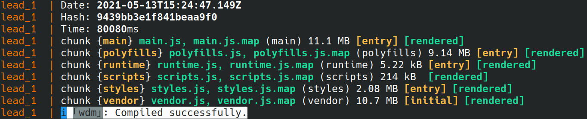
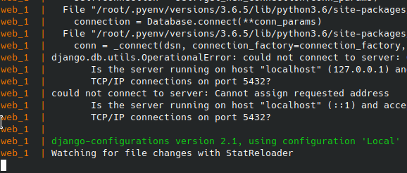

# rd-dev-env
[](https://github.com/mattwhite180/rd-dev-env/actions/workflows/dockertest.yml)


## Dependencies
* works on docker-compose `1.25`

## About
* uses the [Debian](https://hub.docker.com/_/debian) docker image

## Installing Docker on Ubuntu 20.04
```
sudo apt install docker docker-compose docker-doc docker.io -y
sudo usermod -aG docker $USER
sudo systemctl enable docker
# reboot your computer
```
## Setup
* clone the `rd-api` repo in the `web` directory
* clone the `lead-mgmt` repo in the `lead` directory
* create a `bashrc` (no `.` at beginning) in the `web` directory with the following environment variables filled out:
```
# rd-api ENV variables
export DB_USERNAME=
export DB_PASSWORD=
export REPORTING_DB_USERNAME=
export REPORTING_DB_PASSWORD=
export REPLICA_DB_USERNAME=
export REPLICA_DB_PASSWORD=
export REVENUE_OPTIMIZATION_SETTINGS_ENCRYPTION_KEY=
export AWS_FILE_UPLOADER_KEY=
export AWS_FILE_UPLOADER_SECRET_KEY=
export AWS_SNS_ACCESS_KEY=
export AWS_SNS_SECRET_ACCESS_KEY=
export COREAPI_API_KEY=
export COREAPI_SECRET_KEY=
export CREDIT_BUILDER_API_KEY=
export EMAIL_API_KEY=
export EMAIL_SECRET_KEY=
export POSTMARK_API_KEY=
export PUSHER_KEY=
export PUSHER_SECRET=
export PUSHER_SESSION_KEY=
export REDIS_WORK_QUEUE_PASSWORD=
export RENTPLUS_API_KEY=
export RENTPLUS_SECRET_KEY=
export RENTPLUS_ENCRYPTION_KEY=
export REVENUE_OPTIMIZATION_FTP_PASSWORD=
export SISENSE_ACCESS_TOKEN=
export SISENSE_SHARED_KEY=
export TEXTMSGIT_API_KEY=
export TEXTMSGIT_SECRET_KEY=
export TWILIO_FLEX_ACCOUNT_SID=
export TWILIO_FLEX_AUTH_TOKEN=
export TWILIO_MASTER_ACCOUNT_SID=
export TWILIO_MASTER_AUTH_TOKEN=
export ZENDESK_API_TOKEN=
```

add both `"HOST": "db"` and `"PORT": "5432" to the DATABSE dictionaries in `settings.py`

## Execute Program
* run `docker-compose up`
* when you see
	* `watching for file changes with stateReloader` for `web` and
	* `ℹ ｢wdm｣: Compiled successfully.` for lead,
* go to `http://localhost.rentdynamics.com:4200/`




